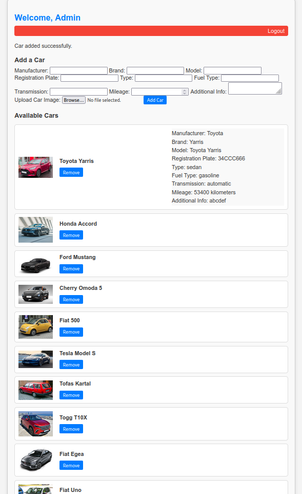
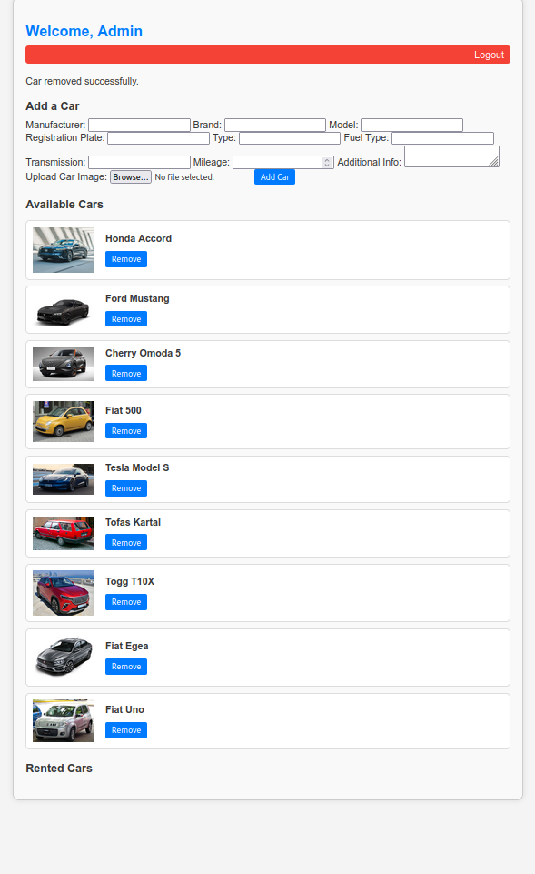
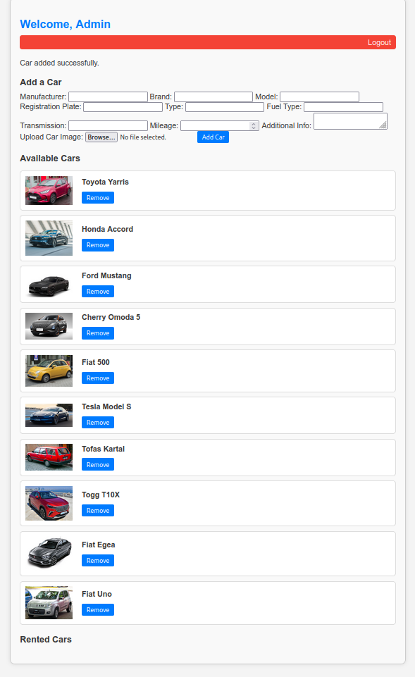
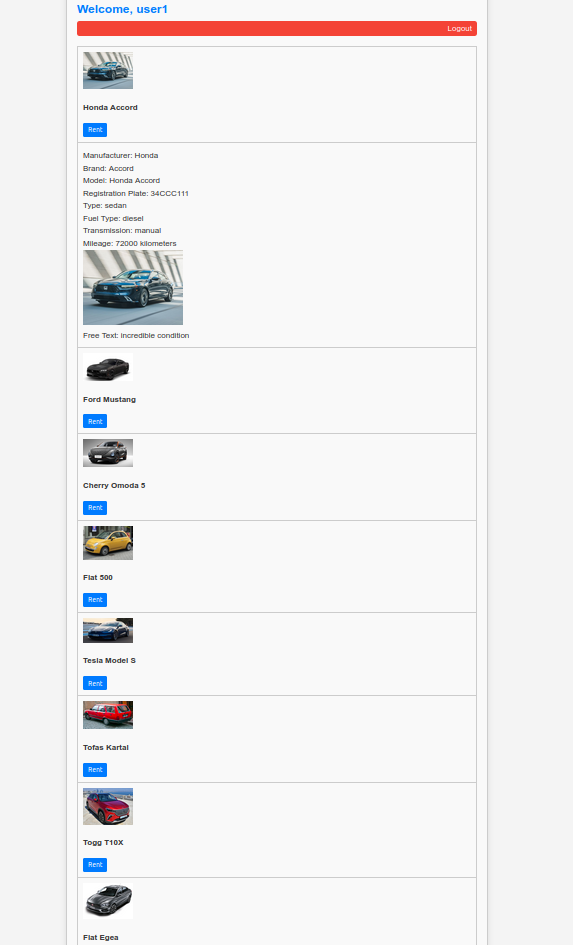
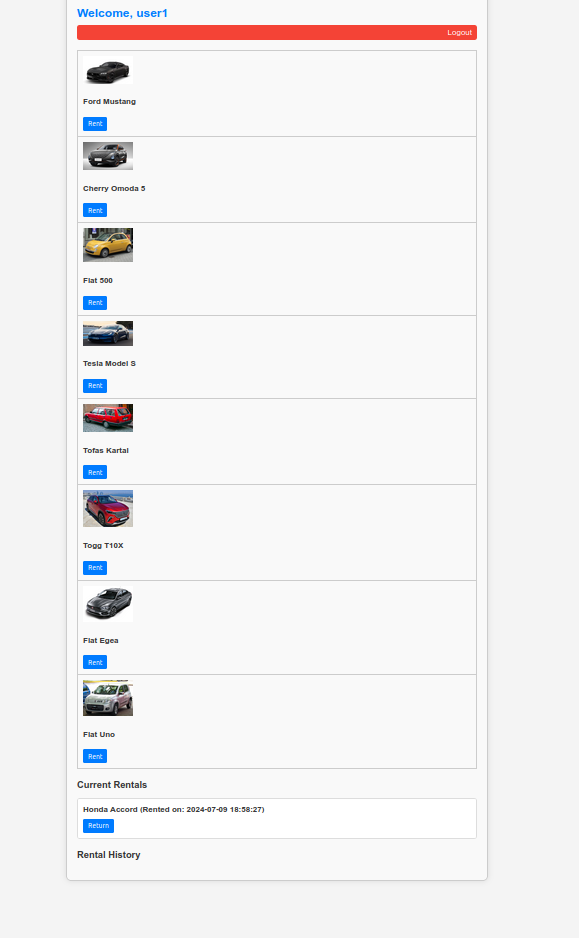
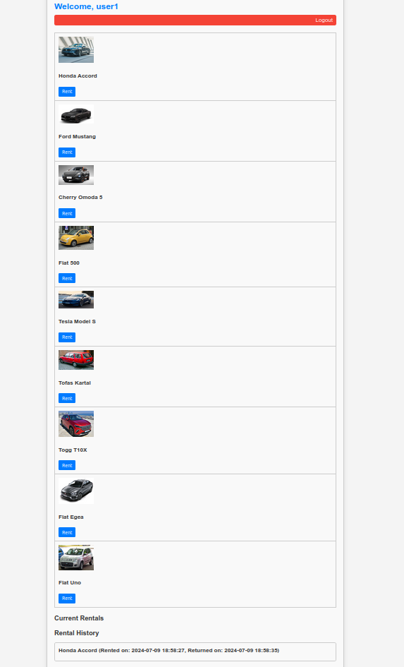
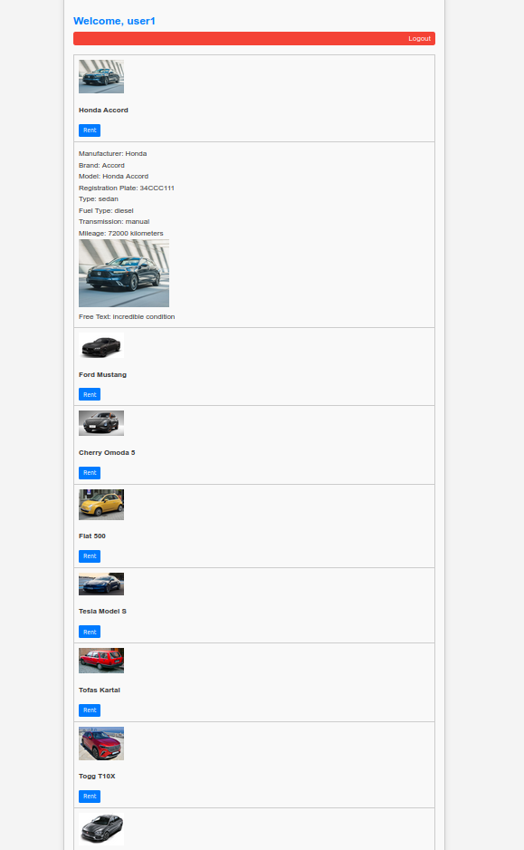
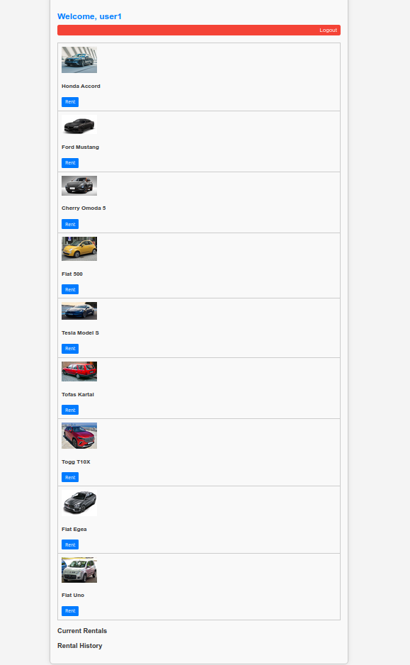

# xammp_car_rental_s7697

## How to launch it 

## 1 - run mysql server with administrator or root privileges
## 2 - make sure to load the car_rental database inside the mysql server with insert option 
## 3 - create a folder inside htdocs directory with the name of your preference 
## 4 - clone or copy the files inside of this repository to the previously created directory 
## 5 - reach the website from localhost/{the name of the file}

    

        
        
admin car info expand

    

    

        
        
car removed successfully

    

    

        
        
admin car added successfully

    

    

        
        
car info

    

    

        
        
user car rented successfully

    

    

        
        
user car returned successfully

    

    

        
        
fiat uno added

    

    

        
        
login page

    

    

        
        
user car expansion

    

    

        
        
user page

    

